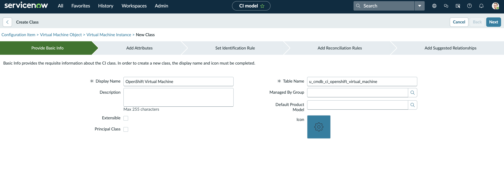
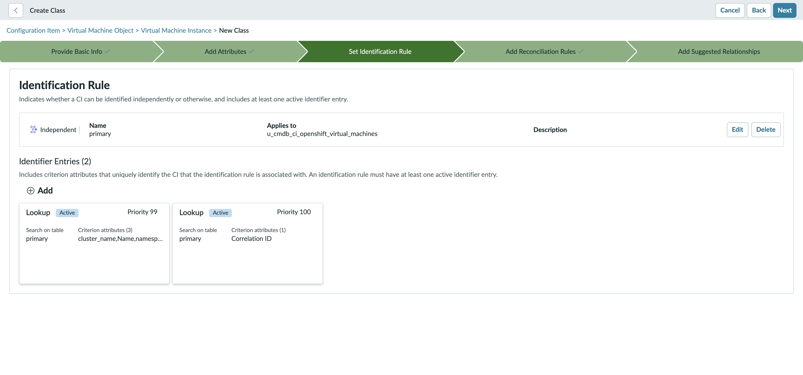
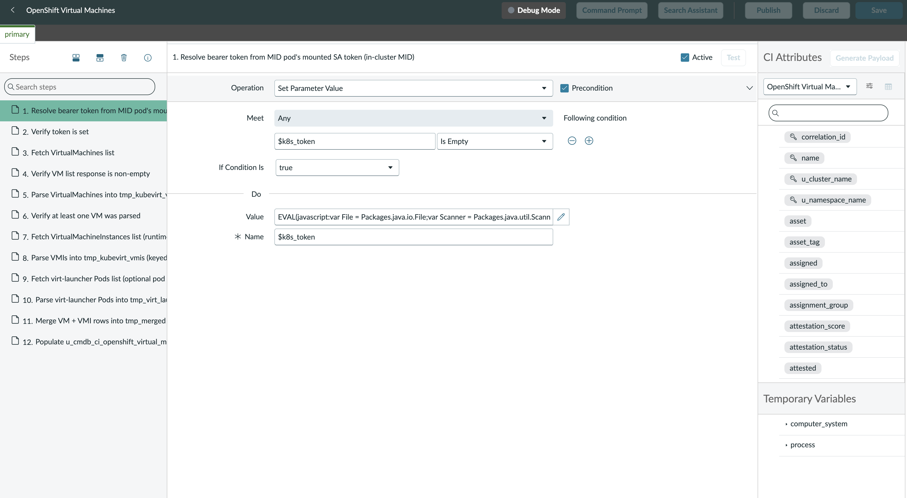
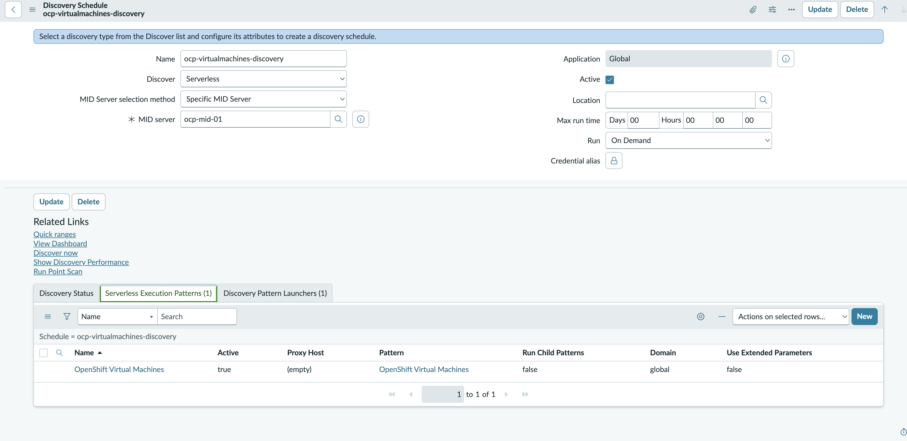
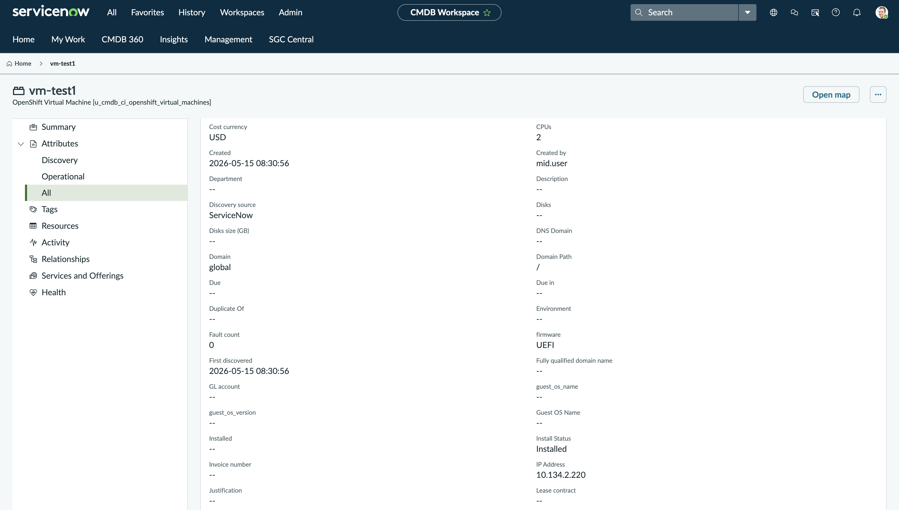

Title: How to discover OpenShift Virtualization VMs as ServiceNow CMDB configuration items with a custom Discovery Pattern (part 2)
Meta title: OpenShift Virtualization ServiceNow CMDB: VM discovery
Meta description: Build a custom KubeVirt VM CI class and ServiceNow Discovery Pattern that creates one configuration item per VM, then schedule and verify the inventory.
URL slug: openshift-virtualization-servicenow-cmdb-vm-discovery-pattern

---

I run virtual machines (VMs) on Red Hat OpenShift Virtualization, and I want every one of them to show up cleanly in ServiceNow. Change management, incident routing, and licensing all depend on it. The stock Kubernetes pattern does not deliver that. It floods the configuration management database (CMDB) with pods, deployments, and nodes, and my KubeVirt VMs never land as VM configuration items (CIs).

In this post I turn a running cluster into a precise inventory: one CI per VirtualMachine, with no pod noise. This is part 2 (Discover) of a two-part series.

In part 1, ["How to set up OpenShift Virtualization ServiceNow CMDB discovery: deploying an in-cluster MID Server"](PUBLISH_URL_PART1), I deployed a registered, certificate-authority-trusted in-cluster ServiceNow MID Server (Management, Instrumentation, and Discovery) with least-privilege kubevirt.io:view role-based access control (RBAC). This post assumes that end state and does not re-teach it. Here I define a custom VM CI class with an independent identification rule, load and run a custom ServiceNow Discovery Pattern, schedule it, and verify the CIs. KubeVirt is the upstream project behind OpenShift Virtualization.

## Prerequisites

This post starts where part 1 ended. I confirm the part 1 outcome with one check: the companion preflight returns HTTP 200 with a VirtualMachineList, and the MID Server shows Up and Validated in the instance. I also need a ServiceNow Australia instance with Discovery and CMDB admin rights, with Pattern Designer and CI Class Manager both opening without error, plus at least one running VirtualMachine to inventory. The runbook covers plugins and access in section 1, and MID validation in section 3. If the preflight does not pass, I fix that first, because every later step depends on that trusted application programming interface (API) path.

## Build, run, and verify VM discovery

I work through five steps: create the CI class, define its identifier, load the pattern, schedule discovery, and verify.

### Step 1 — create the custom OpenShift Virtual Machine CI class

I open CI Class Manager and extend cmdb_ci_vm_instance with a child class. If that parent does not exist on my instance, I fall back to cmdb_ci_vm_object. I name the new table u_cmdb_ci_openshift_virtual_machines and label it OpenShift Virtual Machine. Then I add the KubeVirt-specific attributes that the inherited VM columns do not cover: cluster name and URL, namespace, node, run strategy, status, machine type, firmware, guest OS, vCPU topology, and the VM UID. All of that Kubernetes context lives as plain string columns on the VM row itself, so this flow creates no Kubernetes CIs. One note for the Australia release: it prefixes every user-created column with u_, even in the Global scope. The runbook details the full column list in sections 4 and 4.1, and an optional REST automation in section 4.3.

### Step 2 — define an independent identification rule

KubeVirt UIDs change when a VM is recreated, but the tuple of cluster name, namespace name, and VM name survives stop and start cycles. So I identify on that durable tuple. I open the new class, edit its identification rule, and set the rule to Independent. This stops it from inheriting the VMware-style instance identifier from cmdb_ci_vm_instance. The primary identifier entry uses the three-attribute tuple. The secondary entry uses correlation_id, which holds the UID, as a tiebreaker for a same-named recreated VM. The runbook walks the exact field values in section 4.2.

### Step 3 — load the standalone Discovery Pattern

I create the pattern with type Cloud Resource, not Discovery Pattern. That choice matters: a Cloud Resource pattern is an API-driven horizontal pattern, while a Discovery Pattern uses the IP-probe Shazzam flow (ServiceNow's network-scan phase) I do not want here. I bind the pattern to the new CI class, and because this is the Australia release, I create at least one Identification Section before saving. The data flow is straightforward: an HTTP GET on the virtualmachines endpoint, a second GET on virtualmachineinstances, then a merge on the parent VM UID using a LEFT join so stopped VMs are kept. A Create CI step then produces exactly one VM CI per VirtualMachine, with optional virt-launcher pod enrichment if pod-list RBAC is granted. I have two authoring choices. Pattern Designer is the supported, click-through surface. A one-shot raw PATCH of the NDL (Neebula Discovery Language, ServiceNow's pattern format) using the companion scripts pattern-openshift and pattern-openshift.sh is faster but release-fragile, since it can break across ServiceNow releases. The runbook describes the pattern and both paths in sections 5 through 5.5.

### Step 4 — schedule and run discovery

I create a serverless, on-demand Discovery Schedule and bind it to the specific in-cluster MID Server from part 1. On the pattern launcher I set three attributes: url, cluster_name, and namespace. The url value must include the https:// scheme. A bare host and port is the most common parse failure, and the pattern fails with a cannot-parse-url error. I set no credentials alias, because the pod-mounted service-account token authenticates the call. Then I click Discover Now and watch Discovery, then Status, for the Devices and CIs counts. The runbook covers the schedule and its launcher attributes in section 6 and the schedule-openshift.sh helper, and the run step in section 7.1.

### Step 5 — verify the resulting VM CIs

I open the new class list and expect one row per VirtualMachine, filtering on status Running to see active VMs. I pick one VM and cross-check it against oc get vm with the YAML output: CPU count, memory, run strategy, status, and the cluster, namespace, and node values should all match the live object. I also confirm no Kubernetes CI rows were created. Then I test the lifecycle. I stop a VM and re-discover: the same row stays, its status flips to Stopped, and the node goes blank because the VirtualMachineInstance (VMI) is gone while the VM persists. I delete a VM and re-discover: the row's install status flips to Absent. The runbook lists these checks in section 7.2.

## Common issues and troubleshooting

A few failures come up often. Each one has a clear cause and fix:

- The pattern does not lead to the creation of any CI: an older NDL used a match block as an assertion that never reaches CI creation. Reload the current repo NDL.
- An InaccessibleObjectException on HttpsURLConnection: older NDL called Java directly. The current NDL uses ServiceNow's HTTP call handler instead.
- An empty response from the call handler: the MID Java runtime still does not trust the API certificate. Re-run the part 1 preflight.
- Zero CIs after Create CI: an empty items array or a wrong merge key. Check the parsed temp table and the join on vm_uid.
- A 403 on the virtualmachines endpoint: the kubevirt.io:view binding is missing. A 404 means the operator is not installed.

The runbook cheatsheet has the full matrix.

## Tips and best practices

I prefer Pattern Designer as the authoring surface and treat the raw-NDL PATCH as release-fragile, pinning the doc revision to the instance family I tested against. I identify on the durable cluster, namespace, and name tuple rather than the UID alone. I keep cluster, namespace, node, and pod context as queryable string columns instead of Kubernetes CIs. I also disable any stock Kubernetes schedule so it does not repopulate the noise I worked to avoid.

## Wrap up

I now have a custom VM CI class, an independent identifier, a Cloud Resource pattern, a schedule, and a verified inventory of one CI per VirtualMachine. Success is verifiable: the new class list holds one CI per in-scope VirtualMachine, attributes match the live objects via oc, and zero Kubernetes CIs were created.

## Next steps

Clone and follow [the full runbook on GitHub](https://github.com/MoOyeg/snow-ocpv-discovery) to reproduce this end to end. To go deeper on the platform, explore [Red Hat OpenShift Virtualization](https://www.redhat.com/en/technologies/cloud-computing/openshift/virtualization). If you have not done the MID Server setup yet, start with the prerequisite post, [part 1, "How to set up OpenShift Virtualization ServiceNow CMDB discovery: deploying an in-cluster MID Server"](PUBLISH_URL_PART1).
