# Using ServiceNow with OpenShift Virtualization: Discovering VMs in the CMDB

As teams move virtual machines off legacy hypervisors and onto OpenShift
Virtualization (KubeVirt), one practical question keeps coming up: *how do
those VMs show up in ServiceNow?* For most organizations the CMDB is the
system of record that drives change management, incident routing, and
licensing — so a VM that isn't in ServiceNow effectively doesn't exist to
the rest of IT. This article exists to close that gap.

It matters today because OpenShift Virtualization is increasingly the
landing zone for VMware migrations, and the obvious approach — pointing
ServiceNow's stock *Kubernetes* pattern at the cluster — produces the wrong
result. That pattern imports every pod, deployment, replicaset, service,
and node, which is far more than you want if you only care about VMs, and
KubeVirt VMs never land as VM CIs in that flow anyway: they surface as
`virt-launcher-*` rows in `cmdb_ci_kubernetes_pod`, indistinguishable from
ordinary workloads.

This article takes the opposite, surgical approach. It builds a custom
`u_cmdb_ci_openshift_virtual_machines` CI class and a purpose-built
Discovery Pattern that calls the KubeVirt API directly and creates
**one VM CI per `VirtualMachine`** — and nothing else. No pods, no
deployments, no namespaces, no nodes land in CMDB.

It's laid out as a top-to-bottom walkthrough you can follow on a live
environment: prerequisites and required plugins (§0–§1), the OpenShift
service account and RBAC (§2), deploying an in-cluster MID Server (§3),
defining the custom VM CI class and its identification rule (§4),
authoring the standalone discovery pattern (§5), and finally scheduling
and verifying the inventory (§6 onward). Each step includes both the
ServiceNow UI walkthrough and a scripted REST alternative, so you can
either click through it once or automate it against a fresh instance.

The walkthrough was written and tested against the ServiceNow **Australia**
release; earlier families have a different CI Class Manager UX and don't
show the `u_`-prefix hardening called out in §3.

This article covers the **in-cluster MID Server path only**: the MID Server
runs as a Deployment on OpenShift and authenticates to the Kubernetes API
with its pod-mounted service-account token. An out-of-cluster MID can use
the same high-level model, but it needs a different credential flow
(ServiceNow Kubernetes Credential / Credential Alias), external API
connectivity, and CA trust setup; those steps are intentionally out of
scope here.

Companion files that are not part of the ServiceNow MID recipe are published
in this repository: <https://github.com/MoOyeg/snow-ocpv-discovery>.
It contains:

- `pattern-openshift` — the full Discovery Pattern NDL.
- `pattern-openshift.sh` — create/update the pattern and PATCH the NDL.
- `schedule-openshift.sh` — create/update the Discovery Schedule and pattern
  launcher attributes.
- `ca.sh` — quick manual MID JVM truststore import/Java TLS validation.
- `import_ocp_service_ca.sh` — startup hook for fresh MID pods.
- `mid_kubevirt_preflight.sh` — verify MID pod CA trust, token, and KubeVirt
  API response before running Pattern Debug.

> Audience: anyone with cluster-admin on an OCP cluster and admin (or
> equivalent Discovery/CMDB) access on a ServiceNow Australia instance.

---

## 0. Prerequisites

- [ ] OpenShift cluster (4.14+) reachable on its API URL (`api.<cluster>:6443`).
- [ ] OpenShift Virtualization operator installed (HyperConverged CR healthy).
- [ ] At least one `VirtualMachine` running, so there's something to inventory.
- [ ] `oc` CLI logged in as `cluster-admin`.
- [ ] A ServiceNow Australia instance with admin (or equivalent
      Discovery/CMDB) access.
- [ ] Outbound HTTPS from the cluster (or wherever the MID Server runs) to
      `*.service-now.com`.

---

## 1. Install required plugins

In the instance: **All → System Applications → All Available Applications → All**.
Activate the following (each takes a few minutes):

| Plugin                                                  | ID                              | Why                                                  |
| ------------------------------------------------------- | ------------------------------- | ---------------------------------------------------- |
| Discovery                                               | `com.snc.discovery`             | Patterns engine + Pattern Designer                   |
| Credentials                                             | `com.snc.discovery.credentials` | Optional; useful if you later adapt this design for an out-of-cluster MID |
| Certificate Management                                  | `com.snc.certificate`           | Stores the OCP API CA cert (optional)                |

> **Not needed for this flow.** The *Discovery and Service Mapping
> Patterns* Store app, *Service Mapping*, and *CMDB CI Class Models —
> Containers* are not required — we author our own Pattern and extend
> the core `cmdb_ci_vm_instance` class. Skip them unless you also want
> the full stock K8s discovery.

### Validation

- [ ] **All → Discovery → Pattern Designer** opens without error.
- [ ] **All → Configuration → CI Class Manager** opens without error.
- [ ] `cmdb_ci_vm_instance.list` opens without error (this is the parent
      class we'll extend in §4).

---

## 2. Create the OpenShift service account + RBAC

On the OCP cluster:

```bash
oc new-project servicenow-discovery

oc create serviceaccount snow-discovery -n servicenow-discovery

# kubevirt.io:view ships with the OpenShift Virtualization operator and
# grants read-only access to virtualmachines, virtualmachineinstances,
# virtualmachineinstancemigrations, and the rest of the kubevirt.io/* API.
oc create clusterrolebinding snow-discovery-kubevirt-view \
  --clusterrole=kubevirt.io:view \
  --serviceaccount=servicenow-discovery:snow-discovery
```

> **Why no `cluster-reader`?** This flow only reads `kubevirt.io/v1` —
> no pods, nodes, deployments, etc. `kubevirt.io:view` is the minimum
> viable permission. If you later want to populate the optional
> `virt_launcher_pod_name` column (see §5.4), add
> `oc adm policy add-cluster-role-to-user view -z snow-discovery -n servicenow-discovery`
> so the SA can list pods too.

The in-cluster MID path in §3 uses the pod-mounted service-account token
automatically, so you do not need to mint or copy a Kubernetes bearer
token into ServiceNow.

### Validation

```bash
API=$(oc whoami --show-server)

for path in \
  /apis/kubevirt.io/v1/virtualmachines \
  /apis/kubevirt.io/v1/virtualmachineinstances ; do
  printf '%-55s ' "$path"
  curl -sk -o /dev/null -w '%{http_code}\n' \
    -H "Authorization: Bearer $(oc whoami -t)" "$API$path"
done
```

- [ ] Both paths return `200`. `404` means the KubeVirt operator isn't
      installed; `403` means the ClusterRoleBinding didn't apply.

---

## 3. Deploy a MID Server that can reach the OCP API

We'll run the MID Server **as a Deployment on the same cluster** — simplest
network path, and it lets us authenticate to the KubeVirt API using the
pod-mounted SA token (no credential record needed in ServiceNow).

### 3.1 Generate MID Server credentials in ServiceNow

To communicate with the instance, MID Servers need a user ID and the appropriate role. Create the user ID for a MID Server and grant the ID the mid_server role.:

1. In the All-menu filter navigate **All → User Administration → Users**) → **New**.
2. Fill in:
   - **User ID**: `mid.user`
   - **First/Last name**: anything sensible (e.g. `MID Server`)
   - **Password**: a strong password — **record it**
3. **Submit**, then reopen the new `mid.user` record.
4. Click **Set Password** and set the user password
 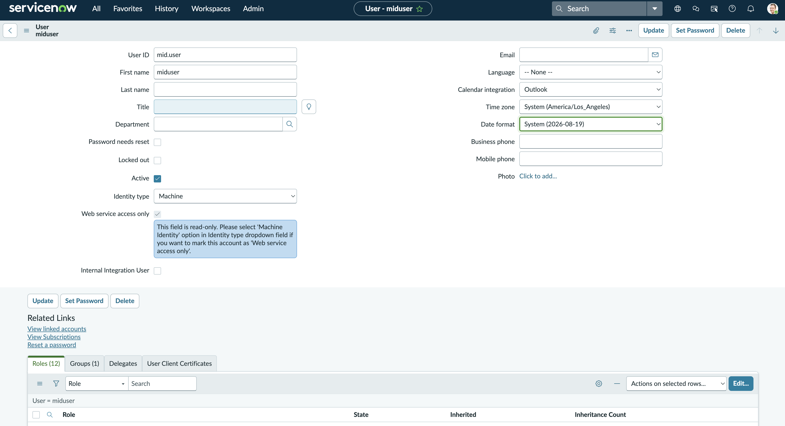
5. Scroll to the **Roles** related list → **Edit** → add `mid_server` →
   **Save**.
 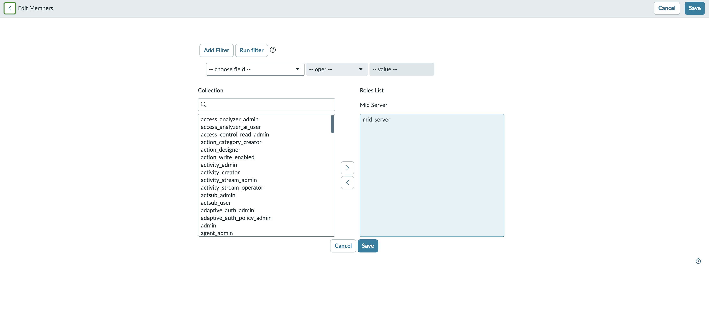

Sanity check: **MID Server → Users** should now list `mid.user`.

### 3.2 Build the MID Server image

ServiceNow publishes a *container recipe* (Dockerfile + asset scripts + signed
manifest) that you build into your own image. Building locally avoids needing
`container.service-now.com` pull credentials in-cluster and lets you pin the
exact MID build that gets deployed.

#### 3.2.1 Get the recipe

1. Log in with a Now account that has
   download rights.
2. **MID Server → Linux Docker recipe** → pick the **Australia** family
   (matching the patch level you want) → download.
   You'll get:
   `mid-linux-container-recipe.australia-<dates>.linux.x86-64.zip`
 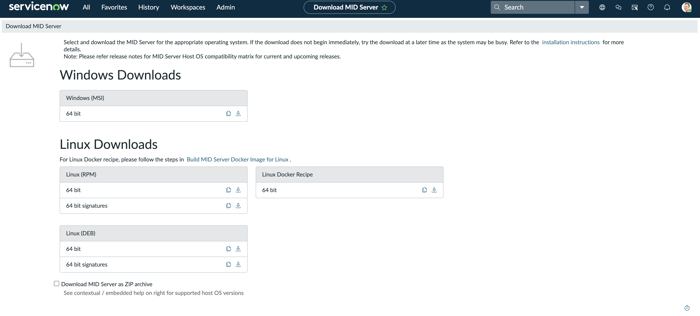
3. Unzip it. The contents are exactly what's in this repo:
   ```text
   Dockerfile                                # multi-stage build
   asset/                                    # init, health, signature scripts
   META-INF/                                 # JAR-style signature for the recipe
   EULA - MID Server.pdf
   ```

#### 3.2.2 (Recommended) Pre-download the MID install ZIP

The Dockerfile's first stage will, by default, fetch the MID install ZIP from
`install.service-now.com` over the network (`MID_INSTALLATION_URL` arg). For
reproducible builds — and so the build doesn't need internet egress — download
the matching install ZIP once and feed it in as a local file:

```bash
# From the recipe's filename, take the trailing "australia-...linux.x86-64.zip"
# and prepend "mid." to get the install ZIP name:
INSTALL_ZIP=mid.australia-02-11-2026__patch1-03-23-2026_03-31-2026_1137.linux.x86-64.zip

curl -fLO "https://install.service-now.com/glide/distribution/builds/package/app-signed/mid/2026/03/31/${INSTALL_ZIP}"

# Drop it into asset/ — the Dockerfile's first stage COPYs asset/* into the
# build dir, so MID_INSTALLATION_FILE just needs the bare filename.
mv "${INSTALL_ZIP}" asset/
```

#### 3.2.3 Add the companion startup hook

The ServiceNow recipe provides the base image files. The OpenShift service-CA
startup hook is a companion file from the repo, not part of the Snow recipe.

**Why bother?** The MID Server's bundled JRE ships its own `cacerts`
truststore, which has no reason to trust OpenShift's internal
`kube-apiserver-service-network-signer` CA. So out of the box every MID pod
fails TLS to `https://kubernetes.default.svc` (`PKIX path building failed` /
`SSLPeerUnverifiedException`), and the Kubernetes/KubeVirt discovery probes
never connect. You *can* fix one pod by hand with `oc exec` + `keytool`, but
that trust is baked into the pod's ephemeral filesystem — it evaporates the
moment the pod is rescheduled, scaled, or the deployment is rolled. The
startup hook makes the import part of pod startup instead: it runs before the
MID wrapper on **every** fresh pod, so autoscaled and restarted pods come up
already trusting the API server with zero manual intervention. Another method to fix this issue is to use a trusted CA with an openshift external route.

```bash
REPO_RAW=https://raw.githubusercontent.com/MoOyeg/snow-ocpv-discovery/main

curl -fL -o asset/import_ocp_service_ca.sh \
  "${REPO_RAW}/asset/import_ocp_service_ca.sh"
chmod 755 asset/import_ocp_service_ca.sh
```

Update the recipe's `Dockerfile` so the final-stage `COPY` line includes
the new script:

```dockerfile
COPY asset/init asset/.container asset/check_health.sh asset/post_start.sh asset/pre_stop.sh asset/calculate_mid_env_hash.sh asset/import_ocp_service_ca.sh /opt/snc_mid_server/
```

Then add the hook to `asset/init` in the `start)` branch, after `midSetup`
and before `midStart`:

```bash
  start)
    midSetup
    /opt/snc_mid_server/import_ocp_service_ca.sh
    midStart
    ;;
```

#### 3.2.4 Build

```bash
IMAGE=quay.io/<your-org>/snow-mid:australia-2026-03-31

# (a) Build with the local install ZIP staged in asset/ (recommended):
podman build \
  --build-arg MID_INSTALLATION_FILE="${INSTALL_ZIP}" \
  -t "${IMAGE}" .

# (b) OR let the build pull the install ZIP from install.service-now.com:
# podman build -t "${IMAGE}" .

podman push "${IMAGE}"
```

Notes on the recipe:

- The first stage runs `validate_signature.sh` against the install ZIP using
  the public keys in `META-INF/`. Don't disable it
  (`MID_SIGNATURE_VERIFICATION=FALSE`) unless you know what you're giving up.
- The final stage is `almalinux:9.2`, runs as a non-root `mid` user (UID 1001,
  GID 1001), and is OpenShift-friendly: file group is `root` with `g=u`
  permissions so OpenShift's randomly-assigned UID-in-root-group can still
  read/execute everything.
- The companion startup hook selects the
  `kube-apiserver-service-network-signer` cert from
  `/var/run/secrets/kubernetes.io/serviceaccount/ca.crt` and imports it into
  the MID JVM truststore as `openshift-service-ca` before the MID wrapper
  starts. That makes every fresh pod trust `https://kubernetes.default.svc`
  without a manual `oc exec`.
- Healthcheck (`check_health.sh`) verifies the wrapper PID + a heartbeat
  within the last 30 minutes.

#### 3.2.5 Make the image pullable from the cluster

If you pushed to a public registry, nothing more to do this is only for a private repo:

```bash
oc create secret docker-registry snow-mid-pull \
  --docker-server=quay.io \
  --docker-username='<robot-or-user>' \
  --docker-password='<token>' \
  -n servicenow-discovery

oc secrets link default snow-mid-pull --for=pull -n servicenow-discovery
```

### 3.3 MID Server Deployment

The critical line is `serviceAccountName: snow-discovery` — it gives the
MID pod the `kubevirt.io:view` permission from §2 via the pod-mounted SA
token, so the §5 pattern can read `/apis/kubevirt.io/v1/*` without any
credential record in ServiceNow.

```yaml
# snow-mid.yaml
apiVersion: v1
kind: Secret
metadata:
  name: snow-mid-creds
  namespace: servicenow-discovery
type: Opaque
stringData:
  MID_INSTANCE_URL: "https://devNNNNNN.service-now.com"
  MID_INSTANCE_USERNAME: "mid.user"
  MID_INSTANCE_PASSWORD: "<password from 4.1>"
  MID_SERVER_NAME: "ocp-mid-01"
---
apiVersion: apps/v1
kind: Deployment
metadata:
  name: snow-mid
  namespace: servicenow-discovery
spec:
  replicas: 1
  selector: { matchLabels: { app: snow-mid } }
  template:
    metadata:
      labels: { app: snow-mid }
    spec:
      serviceAccountName: snow-discovery
      containers:
        - name: mid
          image: quay.io/<your-org>/snow-mid:australia-2026-03-31  # from §3.2.4
          imagePullPolicy: Always
          envFrom:
            - secretRef: { name: snow-mid-creds }
          resources:
            requests: { cpu: "500m", memory: "2Gi" }
            limits:   { cpu: "2",    memory: "4Gi" }
```

```bash
oc apply -f snow-mid.yaml
oc -n servicenow-discovery rollout status deploy/snow-mid
oc -n servicenow-discovery logs -f deploy/snow-mid | head -200
```

If you rebuild and push using the same image tag, keep
`imagePullPolicy: Always` or switch to a new immutable tag and update the
Deployment. Otherwise a rollout restart can come back on the old cached image
without `import_ocp_service_ca.sh`.

The MID Server auto-registers with the instance. Confirm the connect-back
landed before moving on:

```bash
# Pod stdout — first-boot wrapper logs go here; should contain the
# instance hostname and "MID Server is up".
oc -n servicenow-discovery logs deploy/snow-mid \
  | grep -E "imported Kubernetes service CA|MID Server is up|Connected to|service-now\.com"

```

Before you debug the ServiceNow pattern, run the companion preflight from a
machine with `oc` access. It uses the running MID pod's mounted token and CA,
then checks the MID JVM truststore alias:

```bash
REPO_RAW=https://raw.githubusercontent.com/MoOyeg/snow-ocpv-discovery/main

curl -fL -o mid_kubevirt_preflight.sh \
  "${REPO_RAW}/mid_kubevirt_preflight.sh"
chmod 755 mid_kubevirt_preflight.sh
./mid_kubevirt_preflight.sh
```

The final sections should print a Kubernetes JSON `VirtualMachineList`,
`HTTP_STATUS=200`, and `JAVA_HTTP_STATUS=200`. Fix any TLS, DNS, RBAC, or
KubeVirt API error here before running Pattern Designer's **Check Pattern**.

The Java check matters: the pod-mounted `ca.crt` is a bundle, and
`keytool -importcert` only imports one certificate from a bundle. For
`https://kubernetes.default.svc`, the MID JVM must trust the
`kube-apiserver-service-network-signer` certificate.

If the preflight says `Alias <openshift-service-ca> does not exist`, the
running pod does not have the startup hook applied. Rebuild the image after
adding `asset/import_ocp_service_ca.sh`, push it, and `rollout restart` the
Deployment. The updated preflight also prints whether the script exists in
the pod and whether `/opt/snc_mid_server/init` calls it.

If neither command prints anything after ~2 minutes, the MID isn't
reaching the instance — check the **MID Server URL** env, outbound 443,
and that `mid.user` is unlocked with a valid password.

### 3.4 Validate the MID in the instance

1. **MID Server → Servers** — find `ocp-mid-01`(or you choosen name), status should be **Up**
   (may take 2-5 min).
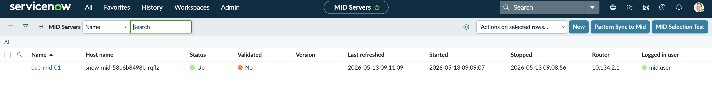
2. Click into it → **Validate** (top-right button) or under Related Links at bottom  → **Validate**.Choose the criteria that works for your organization.
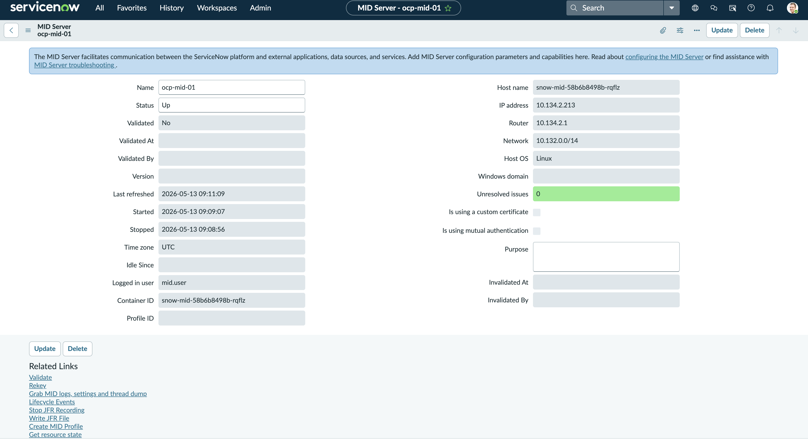
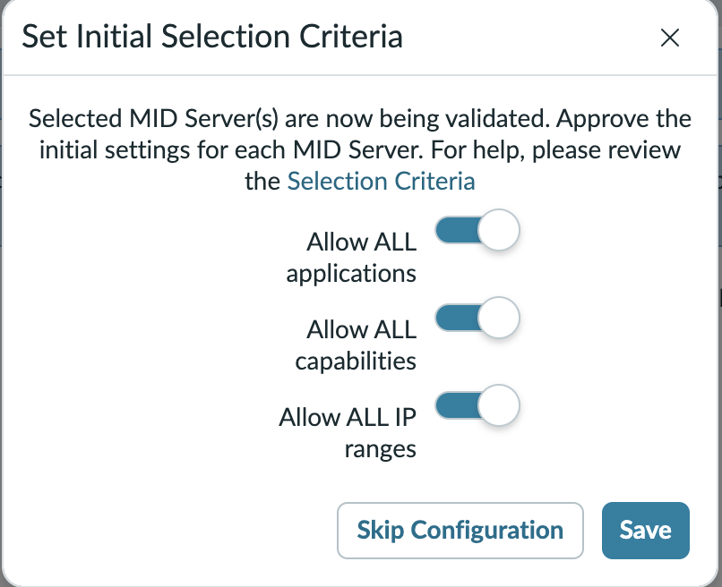
3. Wait for `Validated` = `true`.
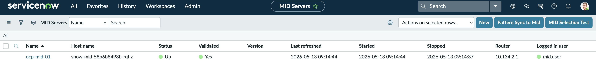


### Validation

- [ ] `ocp-mid-01` is **Up** and **Validated** in ServiceNow.
- [ ] `oc -n servicenow-discovery logs deploy/snow-mid` shows
      `MID Server is up`.

---

## 4. Define the OpenShift Virtual Machine CI class

ServiceNow's CI Class Manager is the supported way to extend `cmdb_ci_*`.There is automation to help streamline the process in 4.3 below.

1. **All → Configuration → CI Class Manager**.
2. Use the search bar at the top of the class-hierarchy panel to find
   the parent class — typing `VM Instance` (or `cmdb_ci_vm_instance`)
   highlights it directly, no need to drill the tree. If that class
   doesn't exist on your instance, fall back to `VM Object`
   (`cmdb_ci_vm_object`) or any other class that your organization prefers.
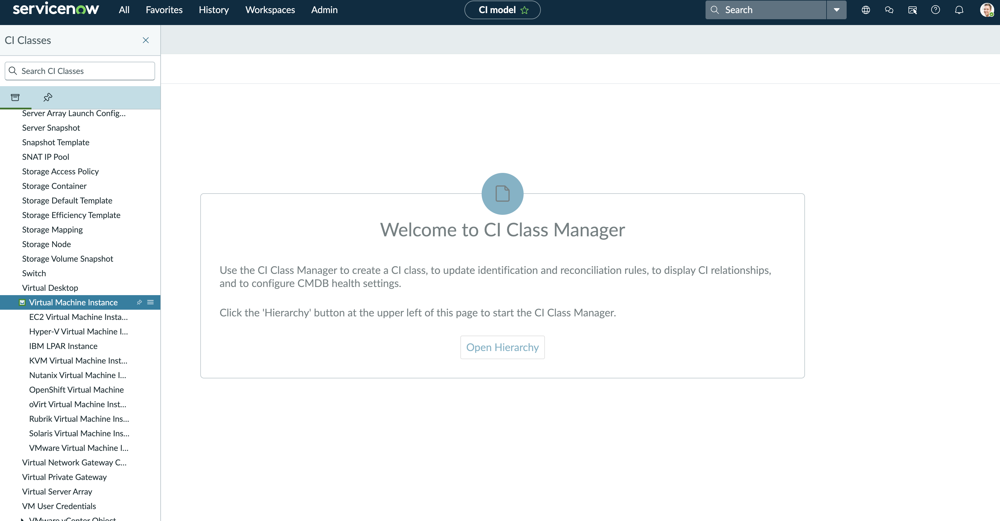
3. Select the parent class and then select `Add Child Class`. Fill in:

   | Field            | Value                                  |
   | ---------------- | -------------------------------------- |
   | Label            | OpenShift Virtual Machine                |
   | Name (table)     | `u_cmdb_ci_openshift_virtual_machines`   |
   | Extends          | `cmdb_ci_vm_instance` (auto-filled)      |
   | Icon             | (optional) any VM-themed glyph           |


4. **Save → Continue**.

### 4.1 Add KubeVirt-specific attributes

On the new class's **Attributes** tab → **Add Attribute** for each row
below. Inherited columns from `cmdb_ci_vm_instance` (`name`,
`correlation_id`, `cpus`, `memory`, `os`, `ip_address`, …) cover the rest.

All KubeVirt context lives on the VM CI itself as plain string columns —
no references to `cmdb_ci_kubernetes_*` classes, since this flow does
not create those CIs.

| Column name             | Type      | Notes                                                       |
| ----------------------- | --------- | ----------------------------------------------------------- |
| `cluster_name`          | String    | The §6 `cluster_name` pattern attribute, e.g. `ocp-prod-1`  |
| `cluster_url`           | String    | API server URL the VM was discovered against (e.g. `https://kubernetes.default.svc`) |
| `namespace_name`        | String    | KubeVirt namespace, e.g. `servicenow-discovery`             |
| `node_name`             | String    | Worker the VMI is running on; empty when VM is stopped      |
| `virt_launcher_pod_name`| String    | virt-launcher pod name; empty when stopped or when pod-list RBAC is not granted (optional — see §5.4) |
| `run_strategy`          | String    | `spec.runStrategy` — Always / RerunOnFailure / Manual / Halted / Once |
| `printable_status`      | String    | `status.printableStatus` — Running / Stopped / Provisioning / … |
| `machine_type`          | String    | e.g. `q35`, `pc-i440fx-rhel7.6.0`                           |
| `firmware`              | String    | Choice list: `BIOS`, `UEFI`, `UEFI-SecureBoot`              |
| `guest_os_name`         | String    | from `vmi.status.guestOSInfo.name`                          |
| `guest_os_version`      | String    | from `vmi.status.guestOSInfo.version`                       |
| `vcpu_sockets`          | Integer   | `spec.template.spec.domain.cpu.sockets` (defaults to 1)     |
| `vcpu_cores`            | Integer   | `spec.template.spec.domain.cpu.cores`                       |
| `vcpu_threads`          | Integer   | `spec.template.spec.domain.cpu.threads` (defaults to 1)     |
| `vm_uid`                | String    | `metadata.uid` — also written to `correlation_id` for cross-source dedup |

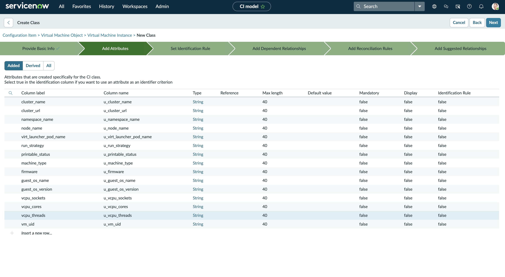
### 4.2 Identification rule

KubeVirt UIDs change on VM recreation, but `(cluster_name, namespace_name,
name)` survives stop/start cycles. Identify on the tuple, with
`correlation_id` (UID) as a tiebreaker for the rare same-name-recreated
case.

1. CI Class Manager → open `OpenShift Virtual Machine` → **Class Info →
   Identification Rule → Edit**.
2. Set the rule **Independent** (don't inherit from `cmdb_ci_vm_instance`,
   whose default identifier is the VMware-style instance ID).
3. **Identifier Entry 1** (primary):
   - **Priority**: `99` (lower number = runs first in IRE)
   - **Criterion attributes**: `u_cluster_name`, `u_namespace_name`, `name` (custom columns are prefixed; `name` is inherited from `cmdb_ci_vm_instance` and stays bare)
   - **Search on table**: `u_cmdb_ci_openshift_virtual_machines`
   - **Allow nulls**: ❌
   - **Active**: ✅
4. **Identifier Entry 2** (secondary, runs only if the primary doesn't match):
   - **Priority**: `100`
   - **Criterion attributes**: `correlation_id`
   - **Allow nulls**: ❌
5. **Save**.


### 4.3 (Optional) Automate §4 – §4.2 via REST

Same end-state as the CI Class Manager walk-through above, scripted
against the Now Platform Table API. Useful for replaying the class
creation on a fresh instance or wiring it into a setup script. Run from any
machine that can reach the instance — no MID required.

```bash
#!/usr/bin/env bash
# Creates u_cmdb_ci_openshift_virtual_machines (table + columns + identifier rule).
# Requires admin REST access; intended for a fresh instance.
# Re-running on an instance where the class already exists will surface
# "duplicate" errors from sys_db_object / sys_dictionary — non-destructive,
# but inspect responses if rerunning.

set -euo pipefail

INST="${SNOW_INSTANCE:?set SNOW_INSTANCE=https://devNNNNNN.service-now.com}"
INST="${INST#https://}"; INST="${INST%/}"
SNOW_USER="${SNOW_INSTANCE_USERNAME:?set SNOW_INSTANCE_USERNAME}"
SNOW_PASS="${SNOW_INSTANCE_PASSWORD:?set SNOW_INSTANCE_PASSWORD}"

BASE="https://${INST}/api/now/table"

snow_api() {
  local xtrace_on=
  case $- in
    *x*) xtrace_on=1; set +x ;;
  esac

  curl -sS -u "${SNOW_USER}:${SNOW_PASS}" \
    -H 'Accept: application/json' \
    -H 'Content-Type: application/json' \
    "$@"
  local rc=$?

  if [[ -n "$xtrace_on" ]]; then
    set -x
  fi
  return "$rc"
}
NEW_TABLE="u_cmdb_ci_openshift_virtual_machines"
NEW_LABEL="OpenShift Virtual Machine"
PARENT="cmdb_ci_vm_instance"     # fall back to cmdb_ci_vm_object if not present

# --- 1. Resolve parent class sys_id -----------------------------------------
PARENT_SYSID=$("${CURL[@]}" \
  "${BASE}/sys_db_object?sysparm_query=name=${PARENT}&sysparm_fields=sys_id&sysparm_limit=1" \
  | python3 -c 'import sys,json; print(json.load(sys.stdin)["result"][0]["sys_id"])')
echo "parent ${PARENT} -> ${PARENT_SYSID}"

# --- 2. Create the table (extends parent) -----------------------------------
"${CURL[@]}" -X POST "${BASE}/sys_db_object" \
  -d "{\"name\":\"${NEW_TABLE}\",\"label\":\"${NEW_LABEL}\",\"super_class\":\"${PARENT_SYSID}\"}" \
  | python3 -c 'import sys,json; r=json.load(sys.stdin).get("result",{}); print("table sys_id:",r.get("sys_id"))'

# --- 3. Add §4.1 custom columns ---------------------------------------------
# element | internal_type | max_length | column_label
COLUMNS=(
  "u_cluster_name|string|100|Cluster Name"
  "u_cluster_url|string|255|Cluster URL"
  "u_namespace_name|string|255|Namespace"
  "u_node_name|string|255|Node Name"
  "u_virt_launcher_pod_name|string|255|virt-launcher Pod"
  "u_run_strategy|string|40|Run Strategy"
  "u_printable_status|string|40|Printable Status"
  "u_machine_type|string|80|Machine Type"
  "u_firmware|string|40|Firmware"
  "u_guest_os_name|string|255|Guest OS Name"
  "u_guest_os_version|string|80|Guest OS Version"
  "u_vcpu_sockets|integer|40|vCPU Sockets"
  "u_vcpu_cores|integer|40|vCPU Cores"
  "u_vcpu_threads|integer|40|vCPU Threads"
  "u_vm_uid|string|80|VM UID"
)
for c in "${COLUMNS[@]}"; do
  IFS='|' read -r ELEM TYPE MAXLEN LABEL <<< "$c"
  "${CURL[@]}" -X POST "${BASE}/sys_dictionary" \
    -d "$(printf '{"name":"%s","element":"%s","internal_type":"%s","max_length":"%s","column_label":"%s","active":"true"}' \
            "$NEW_TABLE" "$ELEM" "$TYPE" "$MAXLEN" "$LABEL")" >/dev/null
  echo "added ${ELEM}"
done

# --- 4. §4.2 identification rule (independent, scoped to new table) ---------
RULE_SYSID=$("${CURL[@]}" -X POST "${BASE}/cmdb_identifier" \
  -d "{\"name\":\"${NEW_LABEL}\",\"applies_to\":\"${NEW_TABLE}\",\"independent\":\"true\",\"active\":\"true\"}" \
  | python3 -c 'import sys,json; print(json.load(sys.stdin)["result"]["sys_id"])')
echo "identifier rule sys_id: ${RULE_SYSID}"

# Primary entry: (u_cluster_name, u_namespace_name, name)
# Lower priority number = runs first in IRE.
"${CURL[@]}" -X POST "${BASE}/cmdb_identifier_entry" \
  -d "{\"identifier\":\"${RULE_SYSID}\",\"priority\":\"99\",\"attributes\":\"u_cluster_name,u_namespace_name,name\",\"allow_null_attribute\":\"false\",\"active\":\"true\"}" >/dev/null
echo "added primary identifier entry"

# Secondary entry: correlation_id (tiebreaker)
"${CURL[@]}" -X POST "${BASE}/cmdb_identifier_entry" \
  -d "{\"identifier\":\"${RULE_SYSID}\",\"priority\":\"100\",\"attributes\":\"correlation_id\",\"allow_null_attribute\":\"false\",\"active\":\"true\"}" >/dev/null
echo "added secondary identifier entry"

echo "done."
```

What this **does NOT** do (vs. the CI Class Manager UI flow):

- **Doesn't set an icon** on the class — CI Class Manager exposes that
  through `cmdb_class_info`; cosmetic only.
- **Doesn't pre-create `sys_documentation` rows** for the new columns.
  `column_label` on `sys_dictionary` is enough for the column header to
  render in lists and forms, but if you want hover help text, add a row
  per column in `sys_documentation`.
- **Doesn't appear in the CI Class Manager hierarchy tree by default.**
  The new table works for discovery, queries, and forms, but if you
  want it to show up under *Configuration → CI Class Manager*, open
  the class once in CI Class Manager and click **Save** — that
  registers the auxiliary metadata.

Verify the result before moving on:

```bash
curl -sS -u "${SNOW_INSTANCE_USERNAME}:${SNOW_INSTANCE_PASSWORD}" \
  -H 'Accept: application/json' \
  "${SNOW_INSTANCE%/}/api/now/table/sys_dictionary?sysparm_query=name=u_cmdb_ci_openshift_virtual_machines^elementSTARTSWITHu_&sysparm_fields=element,internal_type,max_length,column_label" \
  | jq '.result[] | [.element, .internal_type, .max_length, .column_label] | @tsv' -r
```

Should print all 15 `u_*` columns. If it prints fewer, re-check the
loop output for the missing ones — most common failure is a 403 on
`sys_dictionary` when the REST user lacks the `personalize_dictionary`
role.

---

## 5. Author the standalone VM discovery pattern

We can create a Discovery Pattern that now fetches only Virtual Machines. It fetches `/apis/kubevirt.io/v1/virtualmachines` +
`/apis/kubevirt.io/v1/virtualmachineinstances`, joins them on the parent
UID, and creates one `u_cmdb_ci_openshift_virtual_machines` CI per
`VirtualMachine`.There is some automation to help streamline this process below.

### 5.1 Create the pattern shell

1. **All → Pattern Designer → New Pattern**. The form opens on the
   **Basic** tab (the other two tabs — *Pattern* and *Pattern
   Orchestrator* — only become useful after the shell is saved).
2. Fill in the Basic tab:

   | Field             | Value                                                                                |
   | ----------------- | ------------------------------------------------------------------------------------ |
   | Pattern Type      | `Cloud Resource` — the right choice for an API-driven horizontal pattern. **Not** `Discovery Pattern` (that's the IP-probe / Shazzam flow). |
   | Name              | `OpenShift Virtual Machines`                                                          |
   | CI Type           | `OpenShift Virtual Machine`  |
   | Active            | ✅                                                                                    |
   | Operating System  | leave **All** ✅ — KubeVirt VMs aren't classified by guest OS at discovery time       |
   | Run Order         | `None`                                                                                |
   | Description       | optional                                                                              |

3. **Identification Section** related list (lower half of the Basic
   tab): click **New** and create one section. Name it `primary` (the
   name is free-form, but `primary` is the convention used in the rest
   of this article). Australia *requires* at least one Identification
   Section before the pattern can be saved — there is no auto-created
   default.
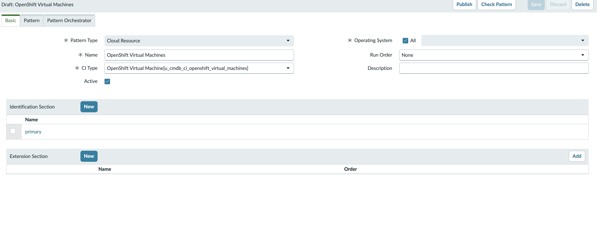
4. **Save**. The pattern re-opens with the `primary` section selected
   and Pattern Designer's step editor visible: empty **Steps** panel on
   the left, the section's CI Attributes bound to `OpenShift Virtual
   Machine` on the right, plus Australia's default scaffolding — one
   placeholder `1. Untitled Step` (Operation = `Set Parameter Value`,
   Value = `--`, Name = `$tmp`) and two unused Temporary Variables
   (`computer_system`, `process`).
5. Leave the placeholder `Untitled Step` alone for now — Pattern
   Designer rejects deleting it with **Cannot delete the last step in a
   section or library** while it's the only step in the section. §5.3
   adds the first real HTTP(S) GET step; once that exists, come back and
   delete the placeholder.
   The two pre-scaffolded Temporary Variables aren't referenced by this
   flow; leave or delete them (§5.3's Parse step will add
   `tmp_kubevirt_vms` to the same panel).

**Alternative: create the shell via REST.** The `Basic`-tab fields above
are all stored on `sa_pattern`, and the *Validate NDL* business rule on
the table auto-generates a valid empty Cloud-Resource NDL (with the
default identification section + the placeholder `1. Untitled Step`)
whenever the `ndl` column is left blank on insert. So the entire UI
walk-through 1-4 above collapses to one POST:

```bash
#!/usr/bin/env bash
# Creates the OpenShift VM discovery pattern shell on a fresh instance.
# Identical end-state to the UI walk-through in §5.1 steps 1-4: a Cloud
# Resource pattern bound to u_cmdb_ci_openshift_virtual_machines, with the
# auto-scaffolded default identification section + placeholder step
# that §5.3-§5.5 will replace.
#
# Pattern *steps* (HTTP GET, Parse, Merge, Create CI) are NOT created
# here. Their bodies are serialized inside the sa_pattern.ndl column as
# the NDL DSL. Either author them in Pattern Designer (§5.3-§5.5) or
# PATCH the whole NDL in one shot from the downloaded pattern-openshift
# file (see "Alternative: deploy steps §5.2-§5.5 via REST" below §5.5).
# Raw-NDL REST bypasses the UI's step builder and is fragile across
# releases — pin the doc revision to the instance release you tested
# against.

set -euo pipefail

INST="${SNOW_INSTANCE:?set SNOW_INSTANCE=https://devNNNNNN.service-now.com}"
INST="${INST#https://}"; INST="${INST%/}"
USER="${SNOW_INSTANCE_USERNAME:?set SNOW_INSTANCE_USERNAME}"
PASS="${SNOW_INSTANCE_PASSWORD:?set SNOW_INSTANCE_PASSWORD}"

BASE="https://${INST}/api/now/table"
CURL=(curl -sS -u "${USER}:${PASS}" -H 'Accept: application/json' -H 'Content-Type: application/json')

PATTERN_NAME="OpenShift Virtual Machines"
CI_TABLE="u_cmdb_ci_openshift_virtual_machines"
# sa_pattern.cpattern_type integer codes (sys_choice on sa_pattern.cpattern_type):
#   1 = Application, 2 = Shared library, 3 = Infrastructure, 4 = Cloud Resource
CPATTERN_TYPE=4

PAYLOAD=$(printf '{
  "name":"%s",
  "cpattern_type":"%d",
  "ci_type":"%s",
  "active":"true",
  "description":"Standalone discovery for KubeVirt VirtualMachines via the OCP API"
}' "$PATTERN_NAME" "$CPATTERN_TYPE" "$CI_TABLE")

# NB: ndl is deliberately omitted — the "Validate NDL" before-insert
# business rule on sa_pattern calls GlidePatternLibrary.createEmptyNdl()
# when ndl is empty and stamps in a valid Cloud-Resource scaffold.
PATTERN_SYSID=$("${CURL[@]}" -X POST "${BASE}/sa_pattern" -d "$PAYLOAD" \
  | python3 -c 'import sys,json; print(json.load(sys.stdin)["result"]["sys_id"])')

echo "pattern sys_id: ${PATTERN_SYSID}"
echo "open the pattern record:"
echo "  https://${INST}/sa_pattern.do?sys_id=${PATTERN_SYSID}"
echo "then open All > Pattern Designer > Discovery Patterns and select:"
echo "  ${PATTERN_NAME}"
```

Re-running this when a pattern of the same name already exists comes
back as HTTP 403 with `Operation against file 'sa_pattern' was aborted
by Business Rule 'Prevent Duplicates and Special Chars'` — that
business rule enforces `sa_pattern.name` uniqueness, so the script is
non-idempotent on its own. To re-run cleanly, delete the existing row
first (`DELETE /api/now/table/sa_pattern/<sys_id>`) or guard the script
with a pre-flight `GET .../sa_pattern?sysparm_query=name=<name>` and
short-circuit if a row already comes back.

What this does **not** do (vs. the UI):

- **Steps** (§5.3-§5.5) are left as the auto-generated `Untitled Step`
  placeholder. Either author them in Pattern Designer per §5.3-§5.5, or
  follow the "Alternative: deploy steps §5.2-§5.5 via REST" block at the
  end of §5.5 to PATCH the full NDL from the downloaded `pattern-openshift`
  file in one shot. The placeholder-deletion gate ("last step in
  section") only matters in the UI path — a full-NDL PATCH replaces the
  whole `identification {}` block atomically.
- **Pattern Attributes / input variables** (`url`, `cluster_name`, `namespace`)
  are bound at runtime by the Discovery Schedule (§6.3), not on the pattern
  record — nothing to set here.

### 5.2 Pattern variables are implicit

Pattern Designer does **not** have a separate "Input Variables" panel.
Variables are bound at runtime in one of two ways:

1. **Pattern Attributes** on the execution-pattern record (the row that
   links a Discovery Schedule to this pattern) — set in §6.3.
2. **Reference them in step expressions** like `${url}` and
   `${cluster_name}`. The first time you use a name, the editor picks
   it up — no pre-declaration needed.

The set we'll use:

| Variable name        | Where it's set                                             | Example value                                                                                          |
| -------------------- | ---------------------------------------------------------- | ------------------------------------------------------------------------------------------------------ |
| `url`                | Pattern Attribute (§6.3)                                   | `https://kubernetes.default.svc`. Must include scheme; a bare host:port value gets parsed as a URI scheme and the pattern fails with `Cannot parse url: ...://null:80null/...` |
| `cluster_name`       | Pattern Attribute                                          | `ocp-prod-1` — written verbatim onto every VM CI's `cluster_name`                                       |
| `namespace`          | Pattern Attribute                                          | `*` or comma-list                                                                                       |
| `k8s_token`          | Auto-resolved from the pod-mounted SA token                | (no manual config)                                                                                     |

### 5.3 Fetch the VM list

In the pattern's main **Identification Section**, add a **HTTP(S) GET**
operation. After this step is saved, go back and delete the §5.1
placeholder `Untitled Step` — it'll now drop cleanly since this real
step keeps the section non-empty.

| Field           | Value                                                      |
| --------------- | ---------------------------------------------------------- |
| URL             | `${url}/apis/kubevirt.io/v1/virtualmachines`               |
| Headers         | `Authorization: Bearer ${k8s_token}`<br>`Accept: application/json` |
| Output variable | `vm_list_json`                                             |

> `${k8s_token}` is populated by the pattern from the MID pod's mounted
> service-account token at
> `/var/run/secrets/kubernetes.io/serviceaccount/token`.

Add a **Parse Variable** step (Type = JSON, Source = `vm_list_json`,
Output = temp table `tmp_kubevirt_vms`):

| Source JSONPath                                            | Temp column         |
| ---------------------------------------------------------- | ------------------- |
| `$.items[*].metadata.name`                                 | `name`              |
| `$.items[*].metadata.namespace`                            | `namespace_name`    |
| `$.items[*].metadata.uid`                                  | `vm_uid`            |
| `$.items[*].spec.runStrategy`                              | `run_strategy`      |
| `$.items[*].spec.template.spec.domain.cpu.cores`           | `vcpu_cores`        |
| `$.items[*].spec.template.spec.domain.cpu.sockets`         | `vcpu_sockets`      |
| `$.items[*].spec.template.spec.domain.cpu.threads`         | `vcpu_threads`      |
| `$.items[*].spec.template.spec.domain.memory.guest`        | `memory_raw`        |
| `$.items[*].spec.template.spec.domain.machine.type`        | `machine_type`      |
| `$.items[*].spec.template.spec.domain.firmware.bootloader.efi.secureBoot` | `secure_boot_raw` |
| `$.items[*].spec.template.spec.domain.firmware.bootloader` | `bootloader_raw`    |
| `$.items[*].status.printableStatus`                        | `printable_status`  |

### 5.4 Fetch the VMI list (runtime state)

KubeVirt splits desired state (`VirtualMachine`) from runtime state
(`VirtualMachineInstance`). Same pattern, different endpoint:

- **HTTP(S) GET URL**:
  `${url}/apis/kubevirt.io/v1/virtualmachineinstances`
- **Output variable**: `vmi_list_json`
- **Parse to** temp table `tmp_kubevirt_vmis`:

| Source JSONPath                                  | Temp column                |
| ------------------------------------------------ | -------------------------- |
| `$.items[*].metadata.name`                       | `name`                     |
| `$.items[*].metadata.namespace`                  | `namespace_name`           |
| `$.items[*].metadata.uid`                        | `vmi_uid`                  |
| `$.items[*].metadata.ownerReferences[0].uid`     | `vm_uid`                   |
| `$.items[*].status.nodeName`                     | `node_name`                |
| `$.items[*].status.interfaces[0].ipAddress`      | `ip_address`               |
| `$.items[*].status.guestOSInfo.id`               | `guest_os_id`              |
| `$.items[*].status.guestOSInfo.name`             | `guest_os_name`            |
| `$.items[*].status.guestOSInfo.version`          | `guest_os_version`         |

> The `ownerReferences[0].uid` on the VMI is the parent VM's UID — that's
> the join key back to `tmp_kubevirt_vms`. Don't join on
> `(name, namespace)` alone: a recreated VM produces a new VMI with the
> same name but different parent UID, and you want to attribute runtime
> state to the right generation.

**(Optional) virt-launcher pod name.** The pod name is
`virt-launcher-<vmi-name>-<5char-suffix>` and is *not* directly available
on the VMI. To populate `virt_launcher_pod_name`, add a third
**HTTP(S) GET** to
`${url}/api/v1/pods?labelSelector=kubevirt.io%3Dvirt-launcher`, parse out
`metadata.name`, and join on the `kubevirt.io/created-by` label (= VMI
UID). Requires adding `view` ClusterRole to the SA — see §2 note.
The companion repo's `pattern-openshift` implements this
best-effort: if the pod list call is denied, the pattern still creates VM
CIs and leaves `u_virt_launcher_pod_name` blank.

### 5.5 Merge VM + VMI → CI

Add a **Merge Tables** step on `vm_uid` (left = `tmp_kubevirt_vms`,
right = `tmp_kubevirt_vmis`, type = LEFT — keep VMs that have no running
VMI, e.g. `runStrategy=Halted`).

Add a **Create CI** step targeting `u_cmdb_ci_openshift_virtual_machines`:

| CI attribute                | Source                                                       |
| --------------------------- | ------------------------------------------------------------ |
| `name`                      | `tmp.name`                                                   |
| `correlation_id`            | `tmp.vm_uid`                                                 |
| `u_vm_uid`                  | `tmp.vm_uid`                                                 |
| `u_cluster_name`            | `${cluster_name}` (input variable from §5.2)                 |
| `u_cluster_url`             | `${url}` (input variable from §5.2)                          |
| `u_namespace_name`          | `tmp.namespace_name`                                         |
| `u_node_name`               | `tmp.node_name`                                              |
| `u_virt_launcher_pod_name`  | (optional) from the §5.4 pod query, otherwise blank          |
| `u_run_strategy`            | `tmp.run_strategy`                                           |
| `u_printable_status`        | `tmp.printable_status`                                       |
| `u_machine_type`            | `tmp.machine_type`                                           |
| `u_firmware`                | `BIOS` if `tmp.bootloader_raw` is null; else `UEFI-SecureBoot` if `tmp.secure_boot_raw == true`; else `UEFI` |
| `u_vcpu_sockets`            | `coalesce(tmp.vcpu_sockets, 1)`                              |
| `u_vcpu_cores`              | `coalesce(tmp.vcpu_cores, 1)`                                |
| `u_vcpu_threads`            | `coalesce(tmp.vcpu_threads, 1)`                              |
| `cpus`                      | `vcpu_sockets * vcpu_cores * vcpu_threads`                   |
| `memory`                    | parse `tmp.memory_raw` (K8s resource quantity) → MB (see below) |
| `u_guest_os_name`           | `tmp.guest_os_name`                                          |
| `u_guest_os_version`        | `tmp.guest_os_version`                                       |
| `os`                        | `tmp.guest_os_id`                                            |
| `ip_address`                | `tmp.ip_address`                                             |

> Inherited columns from `cmdb_ci_vm_instance` (`name`, `correlation_id`, `cpus`, `memory`, `os`, `ip_address`) stay bare. Everything we added in §4.1 is `u_<name>` because Australia prefixes new column elements (see §4 callout).

**Memory parsing.** `domain.memory.guest` is a Kubernetes resource quantity
string (`"1Gi"`, `"2048Mi"`, `"4096M"`, etc.); `cmdb_ci_vm_instance.memory`
is in MB. Add a small inline transform step:

```text
match suffix in tmp.memory_raw:
  *Gi → value * 1024
  *Mi → value
  *Ki → value / 1024
  *G  → value * 1000
  *M  → value
  *K  → value / 1000
  (no suffix, bytes) → value / 1048576
```

No **Lookup CI** or **Create Relationship** steps — those would require
`cmdb_ci_kubernetes_*` rows that this flow does not produce. Cluster /
namespace / node / pod context lives on the VM row as string columns and
is queryable directly (`cluster_name = ocp-prod-1` etc.).

**Alternative: deploy steps §5.2-§5.5 via REST.** Once the NDL DSL is
authored on disk, all four sections collapse to one PATCH against
`sa_pattern.ndl`. Download `pattern-openshift` and `pattern-openshift.sh`
from the companion repo:

```bash
REPO_RAW=https://raw.githubusercontent.com/MoOyeg/snow-ocpv-discovery/main

curl -fL -o pattern-openshift "${REPO_RAW}/pattern-openshift"
curl -fL -o pattern-openshift.sh "${REPO_RAW}/pattern-openshift.sh"
chmod 755 pattern-openshift.sh
```

The `pattern-openshift` file is the exact NDL these sections describe: the §5.3 VM GET
+ Parse, the §5.4 VMI GET + Parse (plus the optional virt-launcher pod
query), the §5.5 Merge + Create CI, and the implicit §5.2 variable
references (`${url}`, `${cluster_name}`, `${k8s_token}`).

```bash
#!/usr/bin/env bash
# Creates or updates the OpenShift Virtual Machines discovery pattern, then
# replaces sa_pattern.ndl with the full NDL from ./pattern-openshift.

set -euo pipefail

SCRIPT_XTRACE_ON=
case $- in
  *x*) SCRIPT_XTRACE_ON=1; set +x ;;
esac

INST="${SNOW_INSTANCE:?set SNOW_INSTANCE=https://devNNNNNN.service-now.com}"
INST="${INST#https://}"; INST="${INST%/}"
SNOW_USER="${SNOW_INSTANCE_USERNAME:?set SNOW_INSTANCE_USERNAME}"
SNOW_PASS="${SNOW_INSTANCE_PASSWORD:-}"
if [[ -z "$SNOW_PASS" ]]; then
  read -rsp "SNOW_INSTANCE_PASSWORD: " SNOW_PASS
  echo
fi

if [[ -n "$SCRIPT_XTRACE_ON" ]]; then
  set -x
fi

NDL_FILE="${NDL_FILE:-./pattern-openshift}"
PATTERN_NAME="${PATTERN_NAME:-OpenShift Virtual Machines}"
CI_TABLE="${CI_TABLE:-u_cmdb_ci_openshift_virtual_machines}"
# sa_pattern.cpattern_type integer codes:
#   1 = Application, 2 = Shared library, 3 = Infrastructure, 4 = Cloud Resource
CPATTERN_TYPE="${CPATTERN_TYPE:-4}"

BASE="https://${INST}/api/now/table"

snow_api() {
  local xtrace_on=
  case $- in
    *x*) xtrace_on=1; set +x ;;
  esac

  curl -sS -u "${SNOW_USER}:${SNOW_PASS}" \
    -H 'Accept: application/json' \
    -H 'Content-Type: application/json' \
    "$@"
  local rc=$?

  if [[ -n "$xtrace_on" ]]; then
    set -x
  fi
  return "$rc"
}

[[ -r "$NDL_FILE" ]] || { echo "NDL file not readable: $NDL_FILE" >&2; exit 1; }

LOOKUP_RESPONSE=$(snow_api -G "${BASE}/sa_pattern" \
  --data-urlencode "sysparm_query=name=${PATTERN_NAME}" \
  --data-urlencode "sysparm_fields=sys_id,name" \
  --data-urlencode "sysparm_limit=1")

PATTERN_SYSID=$(LOOKUP_RESPONSE="$LOOKUP_RESPONSE" python3 - <<'PY'
import json, os, sys

response = json.loads(os.environ["LOOKUP_RESPONSE"])
if "error" in response:
    message = response["error"].get("message", response["error"])
    detail = response["error"].get("detail", "")
    if "not authenticated" in str(message).lower():
        detail = (str(detail) + " Check SNOW_INSTANCE_USERNAME/SNOW_INSTANCE_PASSWORD, rotate any password exposed by bash -x, and confirm Basic Auth/Table API access is allowed for this user.").strip()
    sys.exit(f"lookup failed: {message} {detail}".strip())

rows = response.get("result", [])
print(rows[0]["sys_id"] if rows else "")
PY
)

if [[ -z "$PATTERN_SYSID" ]]; then
  echo "pattern not found, creating: ${PATTERN_NAME}"
  CREATE_PAYLOAD=$(printf '{
  "name":"%s",
  "cpattern_type":"%s",
  "ci_type":"%s",
  "active":"true",
  "description":"Standalone discovery for KubeVirt VirtualMachines via the OCP API"
}' "$PATTERN_NAME" "$CPATTERN_TYPE" "$CI_TABLE")

  CREATE_RESPONSE=$(snow_api -X POST "${BASE}/sa_pattern" -d "$CREATE_PAYLOAD")
  PATTERN_SYSID=$(CREATE_RESPONSE="$CREATE_RESPONSE" python3 - <<'PY'
import json, os, sys

try:
    response = json.loads(os.environ["CREATE_RESPONSE"])
except json.JSONDecodeError as exc:
    sys.exit(f"create returned non-JSON response: {exc}")

if "error" in response:
    message = response["error"].get("message", response["error"])
    detail = response["error"].get("detail", "")
    sys.exit(f"create failed: {message} {detail}".strip())

result = response.get("result")
if not result or not result.get("sys_id"):
    sys.exit("create response did not include result.sys_id")

print(result["sys_id"])
PY
)
else
  echo "found pattern: ${PATTERN_NAME} (${PATTERN_SYSID})"
fi

echo "patching ndl on sa_pattern/${PATTERN_SYSID}"

# Send the NDL as a JSON string. python3 handles the quoting/escaping and
# stamps metadata.id to the target row before upload.
PATCH_RESPONSE=$(
  python3 - "$NDL_FILE" "$PATTERN_SYSID" <<'PY' | snow_api -X PATCH "${BASE}/sa_pattern/${PATTERN_SYSID}" -d @-
import json, re, sys

path, pattern_sysid = sys.argv[1], sys.argv[2]
with open(path) as f:
    ndl = f.read()

ndl, count = re.subn(r'id = "[0-9a-f]{32}"', f'id = "{pattern_sysid}"', ndl, count=1)
if count != 1:
    sys.exit("could not find metadata.id in NDL")

json.dump({"ndl": ndl}, sys.stdout)
PY
)

PATCH_RESPONSE="$PATCH_RESPONSE" python3 - <<'PY'
import json, os, sys

try:
    response = json.loads(os.environ["PATCH_RESPONSE"])
except json.JSONDecodeError as exc:
    sys.exit(f"PATCH returned non-JSON response: {exc}")

if "error" in response:
    message = response["error"].get("message", response["error"])
    detail = response["error"].get("detail", "")
    sys.exit(f"PATCH failed: {message} {detail}".strip())

result = response.get("result")
if not result or not result.get("sys_id"):
    sys.exit("PATCH response did not include result.sys_id")

print("patched:", result["sys_id"])
PY

echo
echo "open the pattern record:"
echo "  https://${INST}/sa_pattern.do?sys_id=${PATTERN_SYSID}"
echo "then open All > Pattern Designer > Discovery Patterns and select:"
echo "  ${PATTERN_NAME}"
```

Caveats:

- The script stamps the current `sa_pattern.sys_id` into the uploaded
  `metadata.id`, but the downloaded `pattern-openshift` file still contains
  the sample sys_id. That is intentional: the deploy script makes the
  per-instance substitution at upload time.
- Pattern Designer is the supported authoring surface. Raw-NDL REST is
  fragile across ServiceNow releases — the DSL grammar shifts between
  Tokyo / Utah / Vancouver / Washington DC / Xanadu / Yokohama /
  Zurich / Australia. This block was validated against **Australia**;
  re-test before reusing on a different family head.
- §5.2 has nothing of its own to deploy — input variables are bound on
  the Discovery Schedule (§6.3), not on the pattern. It's listed here
  only because the NDL references `${url}`, `${cluster_name}`, and
  `${k8s_token}`, which is the implicit declaration §5.2 talks about.

### 5.6 Save & check

1. **Save** the pattern.
2. In Pattern Designer, select **Check Pattern**.
3. In **Pre-execution input**, choose one of:
   - **Manual entry**: paste JSON into **Input Data** for a focused smoke
     test:

     ```json
     {
       "localVariables": {
         "url": "https://kubernetes.default.svc",
         "cluster_name": "ocp-prod-1",
         "namespace": "*"
       }
     }
     ```
     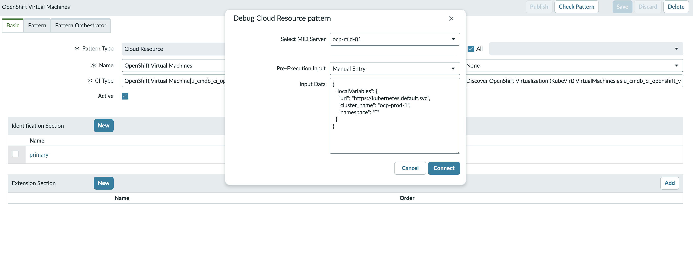
   - **From execution**: reuse values from an existing execution context
     after you have created and run the Discovery Schedule in §6-§7.
  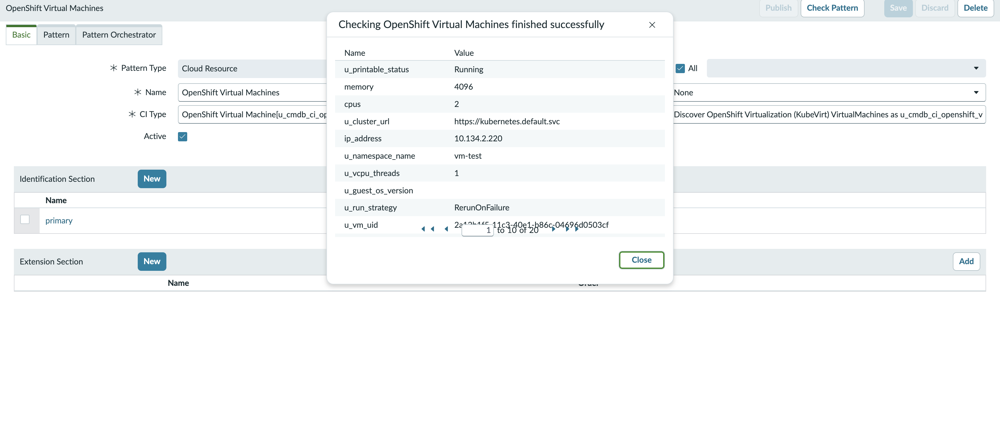
4. Review the check output for HTTP failures, parse errors, and CI creation
   issues before treating the pattern as ready.

If the check reaches `Fetch VirtualMachines list` but the MID log shows
`SSLPeerUnverifiedException`, `Session contains no certificates - Untrusted`,
`PKIX path building failed`, or a similar certificate trust error, import the
right OpenShift service-network CA into the MID JVM truststore.

The pod-mounted `ca.crt` is a bundle. For `https://kubernetes.default.svc`,
Java needs the `kube-apiserver-service-network-signer` cert from that bundle.
Importing the whole bundle with `keytool -importcert` only imports the first
cert, which can make `curl --cacert ca.crt` pass while the MID JVM still fails
TLS.

```bash
#!/usr/bin/env bash
set -euo pipefail

echo "ca.sh version: 2026-05-14-mid-jvm-service-network-ca"

NS="${NS:-servicenow-discovery}"
DEPLOY="${DEPLOY:-snow-mid}"
ALIAS="${KUBERNETES_SERVICE_CA_ALIAS:-openshift-service-ca}"
STOREPASS="${MID_TRUSTSTORE_PASSWORD:-changeit}"
TRUSTSTORE="${TRUSTSTORE:-/opt/snc_mid_server/agent/jre/lib/security/cacerts}"
KEYTOOL="${KEYTOOL:-/opt/snc_mid_server/agent/jre/bin/keytool}"
JAVA="${JAVA:-/opt/snc_mid_server/agent/jre/bin/java}"
TOKEN_FILE="${TOKEN_FILE:-/var/run/secrets/kubernetes.io/serviceaccount/token}"
CA_BUNDLE_FILE="${CA_BUNDLE_FILE:-ocp-kubernetes-service-ca.pem}"
SELECTED_CA_FILE="${SELECTED_CA_FILE:-ocp-kubernetes-service-ca-selected.pem}"
URL="${URL:-https://kubernetes.default.svc}"
PATH_TO_CHECK="${PATH_TO_CHECK:-/apis/kubevirt.io/v1/virtualmachines}"

POD=$(oc -n "${NS}" get pod -l app=snow-mid -o jsonpath='{.items[0].metadata.name}')

oc -n "${NS}" exec "${POD}" -- \
  cat /var/run/secrets/kubernetes.io/serviceaccount/ca.crt > "${CA_BUNDLE_FILE}"

TMP_DIR=$(mktemp -d)
trap 'rm -rf "${TMP_DIR}"' EXIT

awk -v dir="${TMP_DIR}" '
  /-----BEGIN CERTIFICATE-----/ {
    n++
    file = sprintf("%s/cert-%02d.pem", dir, n)
  }
  n > 0 {
    print > file
  }
' "${CA_BUNDLE_FILE}"

SELECTED_CA=""
for cert in "${TMP_DIR}"/cert-*.pem; do
  if openssl x509 -in "${cert}" -noout -subject |
    grep -q 'kube-apiserver-service-network-signer'; then
    SELECTED_CA="${cert}"
    break
  fi
done

if [[ -z "${SELECTED_CA}" ]]; then
  SELECTED_CA=$(find "${TMP_DIR}" -name 'cert-*.pem' | sort | head -n 1)
  echo "WARNING: kube-apiserver-service-network-signer was not found; falling back to ${SELECTED_CA}" >&2
fi

cp "${SELECTED_CA}" "${SELECTED_CA_FILE}"

echo "Selected CA for ${URL}:"
openssl x509 -in "${SELECTED_CA_FILE}" -noout -subject -issuer -fingerprint -sha256

oc -n "${NS}" exec -i "${POD}" -- sh -lc "
  set -e
  cat > /tmp/${ALIAS}.pem
  '${KEYTOOL}' \
    -delete \
    -alias '${ALIAS}' \
    -keystore '${TRUSTSTORE}' \
    -storepass '${STOREPASS}' >/dev/null 2>&1 || true
  '${KEYTOOL}' \
    -importcert \
    -noprompt \
    -trustcacerts \
    -alias '${ALIAS}' \
    -file /tmp/${ALIAS}.pem \
    -keystore '${TRUSTSTORE}' \
    -storepass '${STOREPASS}' >/dev/null
  '${KEYTOOL}' \
    -list \
    -alias '${ALIAS}' \
    -keystore '${TRUSTSTORE}' \
    -storepass '${STOREPASS}'
" < "${SELECTED_CA_FILE}"

oc -n "${NS}" exec "${POD}" -- sh -lc "
  set -e
  cat > /tmp/TestKubeTLS.java <<'EOF'
import java.net.URI;
import java.net.http.HttpClient;
import java.net.http.HttpRequest;
import java.net.http.HttpResponse;
import java.nio.file.Files;
import java.nio.file.Path;

public class TestKubeTLS {
  public static void main(String[] args) throws Exception {
    String token = Files.readString(Path.of(\"${TOKEN_FILE}\")).trim();
    HttpRequest request = HttpRequest.newBuilder(URI.create(\"${URL}${PATH_TO_CHECK}\"))
      .header(\"Authorization\", \"Bearer \" + token)
      .header(\"Accept\", \"application/json\")
      .GET()
      .build();
    HttpResponse<String> response = HttpClient.newHttpClient().send(request, HttpResponse.BodyHandlers.ofString());
    System.out.println(\"JAVA_HTTP_STATUS=\" + response.statusCode());
    String body = response.body();
    System.out.println(body.substring(0, Math.min(160, body.length())));
  }
}
EOF
  '${JAVA}' /tmp/TestKubeTLS.java
"

echo "Imported ${ALIAS} into the MID JVM truststore on pod ${POD}."
echo "For durable fresh pods, rebuild the MID image with the updated import_ocp_service_ca.sh startup hook."
```

That direct `exec` import is a quick validation step on the currently running
pod. Do **not** delete the pod afterward unless the import is also baked into
the image or repeated by an init/start script; a fresh pod starts from the
original image and loses this in-container truststore change.

---

## 6. Create the Discovery Schedule

Use the companion automation to create an on-demand, serverless Discovery
Schedule, link it to the `OpenShift Virtual Machines` pattern, bind it to
the `ocp-mid-01` MID Server, and set the pattern launcher attributes:

```bash
REPO_RAW=https://raw.githubusercontent.com/MoOyeg/snow-ocpv-discovery/main

curl -fL -o schedule-openshift.sh \
  "${REPO_RAW}/schedule-openshift.sh"
chmod 755 schedule-openshift.sh

export SCHEDULE_NAME=ocp-virtualmachines-discovery
export PATTERN_NAME="OpenShift Virtual Machines"
export MID_SERVER_NAME=ocp-mid-01
export CLUSTER_URL=https://kubernetes.default.svc
export CLUSTER_NAME=ocp-prod-1
export NAMESPACE='*'

./schedule-openshift.sh
```

The script upserts:

- `discovery_schedule`: `ocp-virtualmachines-discovery`
- `discovery_ptrn_hostless_lchr`: launcher row for `OpenShift Virtual Machines`
- `discovery_ptrn_lnch_param_def` / `discovery_ptrn_lnch_param`: launcher
  parameter definitions and values

The resulting launcher attributes are:

   | Attribute        | Value                                          |
   | ---------------- | ---------------------------------------------- |
   | `url`            | `https://kubernetes.default.svc`               |
   | `cluster_name`   | `ocp-prod-1` (a free-text identifier you pick) |
   | `namespace`      | `*`                                            |

Do not set a credentials alias for this flow. The pod-mounted service account
token authenticates automatically, and the MID JVM truststore handles TLS
trust for `https://kubernetes.default.svc`.

Manual equivalent:

1. **All → Discovery → Discovery Schedules → New**:
   - **Name**: `ocp-virtualmachines-discovery`
   - **Discover**: `Serverless`
   - **Run**: `On Demand`
   - **MID Server selection method**: `Specific MID Server`
   - **MID Server**: `ocp-mid-01`
   - **Active**: ✅
   - Save.
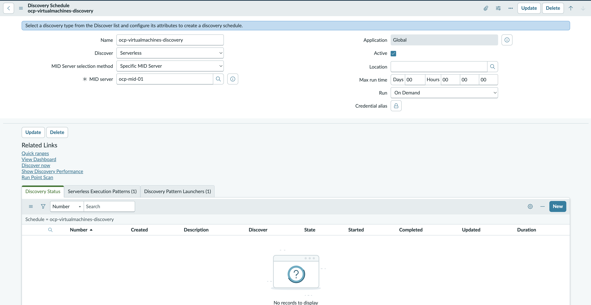
2. Add a **Serverless Execution Pattern** / pattern launcher row for
   `OpenShift Virtual Machines`.
3. On that execution-pattern record, set the launcher attributes listed
   above.


### 6.4 Out-of-cluster MID note

This article does not implement the out-of-cluster MID variant. The
approach is similar at the pattern level, but the MID would call
`https://api.<cluster>:6443`, use a ServiceNow Kubernetes Credential /
Credential Alias for the bearer token, and trust the OpenShift API CA in
the MID JVM truststore. That variant also needs network routing from the
external MID host to the OpenShift API. Keep those concerns separate from
this in-cluster Deployment flow.

### Validation

- [ ] Discovery Schedule `ocp-virtualmachines-discovery` saved with the
      `OpenShift Virtual Machines` pattern attached.
- [ ] Pattern launcher attributes set to `url`, `cluster_name`, and
      `namespace` per §6.
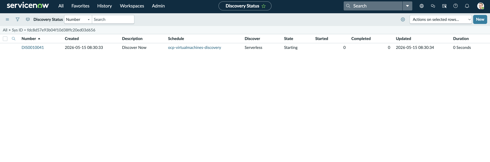
---

## 7. Run discovery + validate

### 7.1 Run discovery

1. Open the Discovery Schedule `ocp-virtualmachines-discovery` →
   **Discover Now** (top-right).
2. Watch progress under **All → Discovery → Status** — find the most
   recent run. When complete, open the run record and check the
   **Devices** + **CIs identified** counts.
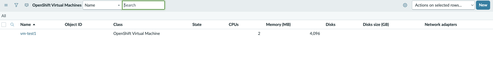
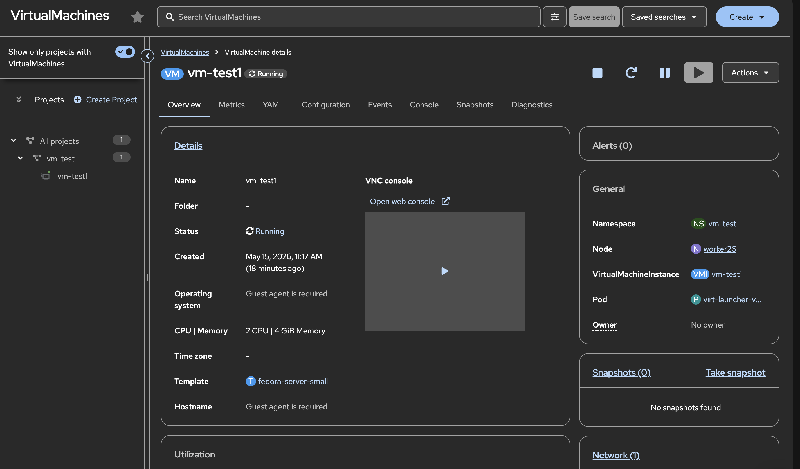

### 7.2 Validation

In the instance:

- [ ] `u_cmdb_ci_openshift_virtual_machines.list` — one row per
      `VirtualMachine` in scope. Add filter `u_printable_status = Running`
      to see active VMs.
- [ ] Open any discovered VM and cross-check it against
      `oc get vm <name> -n <namespace> -o yaml`: `cpus`, `memory`,
      `u_run_strategy`, `u_printable_status`, `u_cluster_name`,
      `u_namespace_name`, and `u_node_name` (whichever worker scheduled
      it) should all match the live object.
- [ ] No `cmdb_ci_kubernetes_*` rows are created by this schedule
      (`cmdb_ci_kubernetes_pod.list` should be empty unless you also ran
      the stock K8s pattern separately).
- [ ] Stop a running VM (`virtctl stop <name> -n <namespace>`) →
      re-discover → same row, but `u_printable_status = Stopped`,
      `u_node_name` blank (the VMI is gone, the VM persists).
- [ ] Delete a VM (`oc delete vm <name> -n <namespace>`) →
      re-discover → row's `install_status` flips to *Absent* (per the
      identification rule's reconciliation policy).

On the MID side, a healthy run looks like this in
`/opt/snc_mid_server/agent/logs/agent0.log.0`:

```
HorizontalDiscoveryProbe ... finish to insert to ECC queue all pages for pattern : OpenShift Virtual Machines
Worker completed: HorizontalDiscoveryProbe ... time: 0:00:NN
```

---

## 8. Cleanup

```bash
oc delete clusterrolebinding snow-discovery-kubevirt-view
oc delete project servicenow-discovery
```

In ServiceNow:

- **Discovery Schedule**: *All → Discovery → Discovery Schedules* →
  `ocp-virtualmachines-discovery` → **Delete**.
- **Pattern**: Pattern Designer → `OpenShift Virtual Machines` →
  top-bar **⋮ → Delete pattern**.
- **CI class**: CI Class Manager → `OpenShift Virtual Machine` → top-bar
  **⋮ → Delete class**. This drops the table
  (`u_cmdb_ci_openshift_virtual_machines`) and any rows in it. If you want
  to keep the table but stop populating it, just delete the schedule +
  pattern and leave the class alone.
- **MID Server record**: *MID Server → Servers* → `ocp-mid-01` →
  **Delete** (after the pod is gone it will go *Down* on its own).

### 8.1 Removing already-imported CIs

If you experimented with the stock K8s pattern before settling on this
VM-only flow, the CMDB has hundreds-to-thousands of `cmdb_ci_kubernetes_*`
rows you may want to wipe. *System Definition → Scripts - Background*
(Global scope) — count first, then delete:

```javascript
// Step 1: count
var dict = new GlideRecord('sys_db_object');
dict.addQuery('name', 'STARTSWITH', 'cmdb_ci_kubernetes');
dict.orderBy('name');
dict.query();
while (dict.next()) {
  var t = dict.getValue('name');
  var gr = new GlideRecord(t);
  if (gr.isValid()) {
    gr.query();
    gs.info(t + ': ' + gr.getRowCount());
  }
}
```

```javascript
// Step 2: delete (only after reviewing counts)
var dict = new GlideRecord('sys_db_object');
dict.addQuery('name', 'STARTSWITH', 'cmdb_ci_kubernetes');
dict.query();
while (dict.next()) {
  var t = dict.getValue('name');
  var gr = new GlideRecord(t);
  if (!gr.isValid()) continue;
  gr.query();
  var n = gr.getRowCount();
  gr.deleteMultiple();
  gs.info('Deleted ' + n + ' from ' + t);
}
```

Disable any active stock K8s schedule before running, or it'll repopulate.

---

## Troubleshooting cheatsheet

| Symptom                                    | Likely cause                                       | Fix                                                                 |
| ------------------------------------------ | -------------------------------------------------- | ------------------------------------------------------------------- |
| MID Deployment CrashLoopBackOff            | Wrong instance URL / creds                         | `oc logs` → check `MID_INSTANCE_*` env, fix Secret, rollout restart |
| MID **Down** in instance after 5 min       | Outbound 443 blocked from cluster                  | Check egress firewall / proxy; set `MID_PROXY_*` env if needed      |
| `Cannot parse url: ...://null:80null/...`  | `url` pattern attribute is missing the scheme       | Set `url = https://api.<cluster>:6443` or `https://kubernetes.default.svc` — must include `https://` |
| `SSLPeerUnverifiedException`, `Session contains no certificates - Untrusted`, or `PKIX path building failed` | MID JVM does not trust the Kubernetes API service-network certificate | Use `https://kubernetes.default.svc` from the in-cluster MID pod, then run the current `ca.sh` or rebuild with the current `import_ocp_service_ca.sh`. The truststore alias fingerprint must match `kube-apiserver-service-network-signer`, and preflight must show `JAVA_HTTP_STATUS=200`. |
| Preflight shows `Alias <openshift-service-ca> does not exist` | The running MID image does not include the startup hook, `asset/init` is not calling it, or the pod has not been restarted onto the rebuilt image | Re-run the §3.2.3 edits, rebuild and push the image, then `oc -n servicenow-discovery rollout restart deploy/snow-mid`. Re-run `mid_kubevirt_preflight.sh`; its **Startup hook wiring** section should show both the script and the `init` hook. |
| `Pattern does not lead to the creation of any CI` immediately after `Verify VM list response is non-empty` | Older NDL used `match {}` as an assertion before the CI-producing transform, and Australia can treat that as an identification section that never reaches CI creation | Download the current `pattern-openshift` and `pattern-openshift.sh` from the companion repo, then rerun `./pattern-openshift.sh`. In Pattern Designer, confirm the loaded step list continues into `Parse VirtualMachines into tmp_kubevirt_vms`, `Merge VM + VMI rows into tmp_merged`, and `Populate u_cmdb_ci_openshift_virtual_machines`. |
| `InaccessibleObjectException` mentioning `sun.net.www.protocol.https.HttpsURLConnectionImpl` | Older NDL used direct Java `URLConnection` calls, which Rhino cannot invoke safely under the Java module system | Download the current repo NDL, which uses ServiceNow's `HttpCallHandler`, then rerun `./pattern-openshift.sh`. |
| `Fetch VirtualMachines list` fails with `GET virtualmachines returned an empty response from HttpCallHandler` | The MID made the call but ServiceNow returned no body to the pattern step; most often the MID JVM still does not trust the Kubernetes API certificate | Download the current repo NDL, then run `mid_kubevirt_preflight.sh` from the companion repo. The preflight must show the truststore alias, token length, `HTTP_STATUS=200`, and `JAVA_HTTP_STATUS=200` with a `VirtualMachineList`. |
| Pattern run completes but 0 VM CIs created after the Create CI step runs | KubeVirt API returned an empty `items` array, the parse table is empty, or the merge step keyed off the wrong field | Curl `/apis/kubevirt.io/v1/virtualmachines` with the SA token and confirm items are returned; in Pattern Designer's Quick Test, check the parsed VM temp table is populated and the merge ran on `vm_uid` |
| 403 on `/apis/kubevirt.io/v1/virtualmachines` | `kubevirt.io:view` ClusterRoleBinding missing       | Re-run §2's `oc create clusterrolebinding` |
| 404 on `/apis/kubevirt.io/v1`              | KubeVirt / OpenShift Virtualization operator not installed | Install the OpenShift Virtualization operator and create a `HyperConverged` CR |
| `"VM Instance" not in CI Class Manager tree` | Tree labels/depth vary by release                  | Use the search bar; or extend `cmdb_ci_vm_object` instead; or type the class name directly into the *Extends* field when creating the class |

---

## Appendix: useful console paths

- Build / version: **System Diagnostics → Stats → Stats**
- Plugin inventory: **System Applications → All Available Applications → All**
- MID Servers: **MID Server → Servers**
- Discovery runs: **Discovery → Status**
- Pattern Designer: **Discovery → Pattern Designer**
- CI Class Manager: **Configuration → CI Class Manager**
- CMDB queries: type any `cmdb_ci_*.list` in the filter navigator
- Logs from a discovery probe: open the Discovery Status record →
  **Discovery Devices** → drill into a row → **ECC Queue** entries
- MID Server logs (in-cluster): `oc -n servicenow-discovery exec
  deploy/snow-mid -- tail -f /opt/snc_mid_server/agent/logs/agent0.log.0`
